# Pet Sitter App Project

This is the Readme.md file for my week-6 fundamental project for QA.

## Contents :
* [Brief](#brief)
   * [Additional Requirements](#additional-requirements)
   * [My Approach](#my-approach)
* [Architecture](#architecture)
   * [Database Structure](#database-structure)
   * [CI Pipeline](#ci-pipeline)
* [Project Tracking](#project-tracking)
* [Risk Assessment](#risk-assessment)
* [Testing](#testing)
* [Front-End Design](#front-end-design)
* [Known Issues](#known-issues)
* [Future Improvements](#future-improvements)
* [Authors](#authors)

## Brief
I have been asked to produce a CRUD application which allows me utilize 'Create', 'Read', 'Update' and 'Delete' functions within an integrated relational database. In order to successfully fulfil this criteria, I have utilised supporting tools, methodologies and technologies that have been shown throughout the core modules covered during training.

The purpose of this project is to emonstrate that I have learnt technical skills over the course of my first few weeks at QA.

### Additional Requirements
In order to successfully meet the specifications of this project, I have included the following supporting tools in my project.

* A Trello board.
* A relational database, which models a clear relationship.
* Clear documentation of the design phase, app architecture and risk assessment.
* A python-based functional application that follows best practices and design principles.
* Test suites for the application, which will include automated tests for validation of the application.
* A front-end website, created using Flask.
* Code integrated into a Version Control System which will be built through a CI server and deployed to a cloud-based virtual machine i.e. Git, Jenkins and GCP.

### Methodology
To achieve the required specification, I have created a simple Pet Sitter app which is a front-end web application that illustrates the  relation between users and their pets. It will allow a user to input 1 or more users and attribute one or more pets to the user(s).

* Create Owner/Pet fields which (satisfies 'Create') that stores:
   * *First Name*
   * *Last Name*
   * *Age*
   * *Address*
   * *Postcode*
   * *Pet's Name*
   * *Pet's Age*
   * *Pet's Colour*
   * *Pet's Species*
   * *Pet's Breed*
   * *Pet's Registered Address*
   * *Pet's Registered Postcode*
* View the user created owner and pet fields (satisfies 'Read')
* Update the existing user created owner and pet fields (satisfies 'Update')
* Delete an existing user created owner or pet field (satisfies 'Delete')

## Architecture
### Database Structure
Pictured below is an entity relationship diagram (ERD) showing the structure of the database.

<<<<<<< HEAD
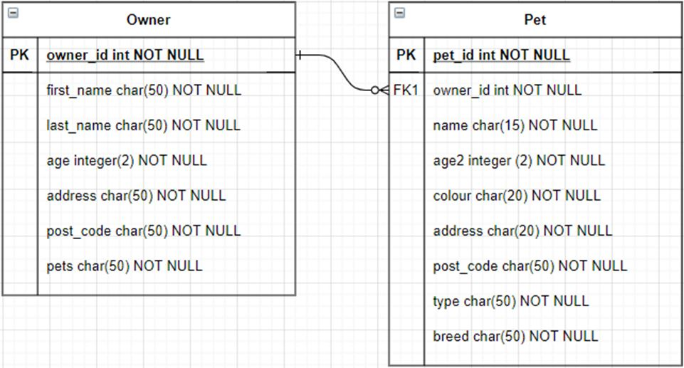
=======
ERD - (https://imgur.com/a/8sHbNev)
>>>>>>> 7faaf7414d89b3dc40e57f7e70075ebc00c42b52

As shown in the ERD, the app models a one-to-many relationship between owner and pet entities using an association table. This allows a user to create an owner entity and associate more than one pet with each owner.

### CI Pipeline
<<<<<<< HEAD
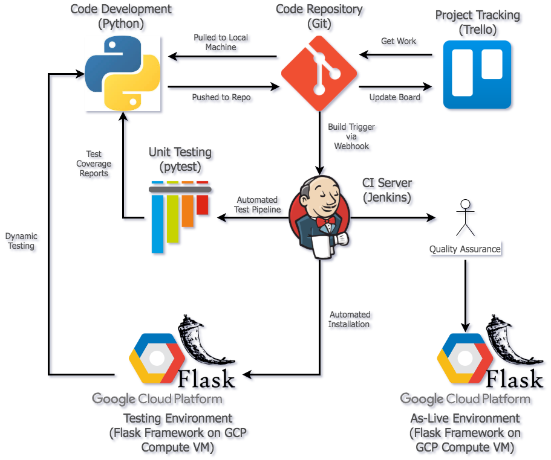

=======
CI Pipeline - (https://camo.githubusercontent.com/9d863508f3423eb1628f569adcc0972e26747bcbfb924c745fd471303e0393f0/68747470733a2f2f692e696d6775722e636f6d2f3247376a6f46702e706e67
) - Produced by Harry Volker
>>>>>>> 7faaf7414d89b3dc40e57f7e70075ebc00c42b52
 Above is the continuous integration pipeline with the associated frameworks and services related to them. This purpose of the pupline is to ensure the successive and automated development-to-deployment via automation of the integration processes. I can produce code on my local machine and push it to GitHub. The automation tools in place will then allow for new code to be pushed to Jenkins via a webhook to be automatically installed on the google cloud's Virtual Machine. At this point, the tests are then automatically executed and reports which illustrate the results are produced. In addition to this, A seperate testing environment for the app is  run within debugger mode which will allow for successive dynamic testing.

This process is handled by a Jenkins 'pipeline' job with incremental build stages. The perfect design of Jenkins is such that it will output detailed information for a failed job. For example, if a previous build stage fails, the job will fail altogether and provide you with detailed information as to where this occurred. The more modular you make the system is made, the easier it is to pinpoint where the code is failing. This is because more incremental stages makes distinguishing easier. As pictured below, the four build stages are:
* 'Checkout SCM' (pull code from Git respository)
* 'Build' (would be more accurately named 'Installation' as Python doesn't require building, in the strictest sense)
* 'Test' (run pytest, produce coverage report) 
* 'Run' (start the flask-app service on the local VM, belonging to systemctl)

<<<<<<< HEAD
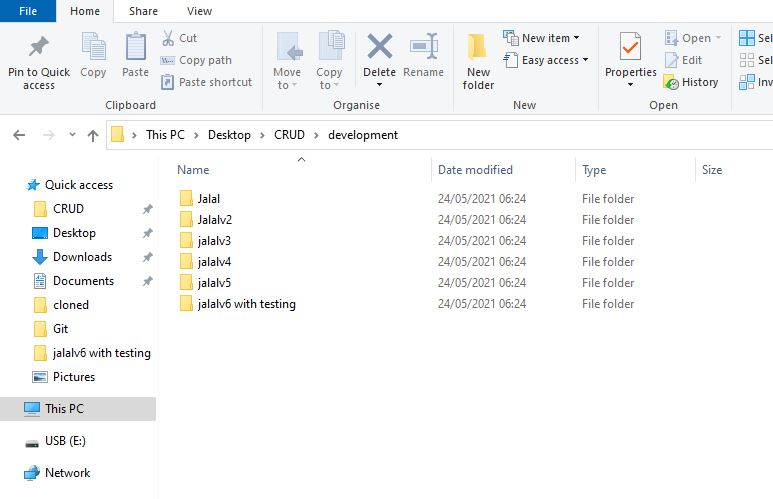
=======
Better understanding of this can be seen by looking at the "Development" folder I have added which shows my progress where i started from scratch right up to deployment.
>>>>>>> 7faaf7414d89b3dc40e57f7e70075ebc00c42b52

Once the app is considered stable, it is then pushed to an independent VM which is run on the cloud for deployment. This service is run using the Python-based HTTP web server Gunicorn, which is designed around the concept of 'workers'. This essentially reduces the workload by splitting the CPU resources of the VM equally. When users connect to the server, a worker is assigned to that connection with their dedicated resources, allowing the server to run faster for each user.

## Project Tracking
<<<<<<< HEAD
In order to track the progress and criteria of my project Trello was utilized to for this particular project. Although it was optional and the specification wasn't too strict, I felt that Trello was appropriate due to its simplicity.
You can find the link to my Trello board here:
=======
In order to track the progress and criteria of my project Trello was utilized to track the progress of this particular project. You can find the link to my Trello board here:
>>>>>>> 7faaf7414d89b3dc40e57f7e70075ebc00c42b52

The board has been designed such that elements of the project move from left to right from their point of conception to being finished and fully implemented.
* *Project Requirements*
   A list of requirements set out in the brief in order for this to be a successful project.
* *Project Resources*
   List of relevant resources for quick access.
* *User Stories*
   Any functionality that is implemented into the project is intorduced as a user story. This ensures that the development of every element of the web app is focused entirely on the user experience first.
* *Planning*
   The initial stages where a specific element (e.g. a block of code, a server, etc.) is being considered for implementation.
* *In Progress*
   Once the element has had any code written for it/exists in any way, it is placed in the 'in progress' list.
* *Testing*
   Once the element has been created, it moves to the 'testing' list, where its functionality is tested.
* *Finished*
   Any element that is considered to be finished (i.e. works according to its specification) lives in this list.

## Risk Assessment
The risk assessment for this project can be found in full here: https://drive.google.com/file/d/1TTOwWYVql7eh4ftqLLOEpV-zif4iTCNM/view?usp=sharing

Here's a quick screenshot:

## Testing
pytest is used to run unit tests on the app. These are designed to assert that if a certain function is run, the output should be a known value. It is a method of authentication or validation to one's code. Jenkins produces console outputs (pictured below) that will inform the developer how many tests the code passed and which tests they failed.

pytest also produces a coverage report to show how much of the code in the app has been successfully tested. Jenkins automatically moves this report to the 'templates' folder so that it can be navigated to in a browser. The following value: 66% is the result of running pytest on my web app.

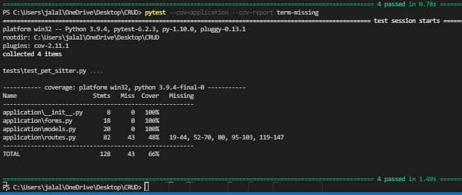

## Front-End Design
The front-end of the app is limited to very basic principles and coding at this stage, as the front-end is built purely with very simple HTML. It is largely functional and stable. When initially opening the app. The user lands on the route "/" where they are met with

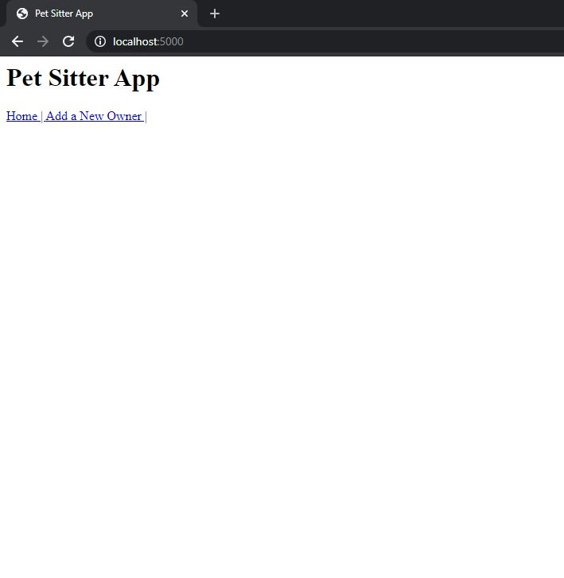
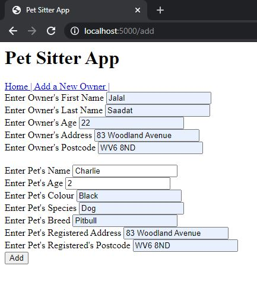
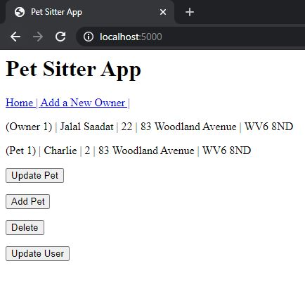
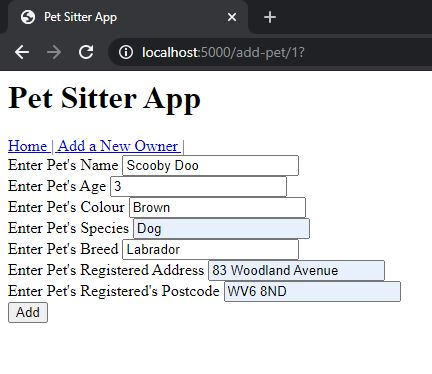
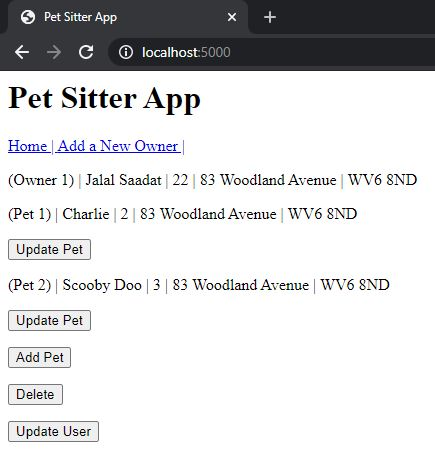
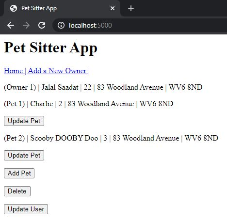
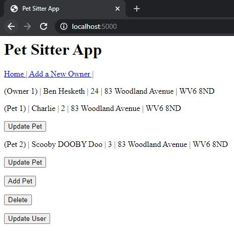

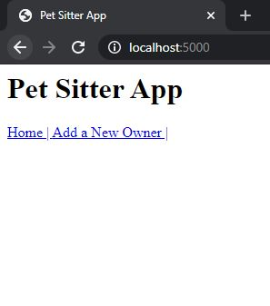

## Known Issues
There is one bug that I am aware of with the current build of the app:
* If a user attempts to go to a url equal to an owner_id which is not yet present, the app will fail in Jenkins.
## Future Improvements
* Filter posts by date, location and alphabetical order.
* Aesthetic overhaul, to make the front-end both more appealing *and* more functional
   * The aesthetics of an interface is incredibly important for the functionality of a web app, a user is only able to use a web app to the point at which they understand. Confusing aesthetic design will obscure the functionality of the app and poor GUI may make using the app difficult.

## Authors
Jalal Saadat
